# Configure ROS development environment on Windows Tutorial

This step by step tutorial is for those rookies who are trying to develop ROS on windows yet are suffering from confusing errors. ROS installation setps can be found on [Official Microsoft github page](https://ms-iot.github.io/ROSOnWindows/GettingStarted/Setup.html) I am just doing an integration and tried out some useful step you can follow after installation. You can skip part one if you have installed ROS already.

## Prerequisite:
1. Reserve space for the installation  
    Reserve 10 GB free space under clean and enpty `c:\opt` before proceeding.  
2. Install [Visual Studio](https://visualstudio.microsoft.com/) with C++ core using visual studio installer  

3. Create a new shortcut for Visual Studio CMD (Anywhere on your desktop)  
  
    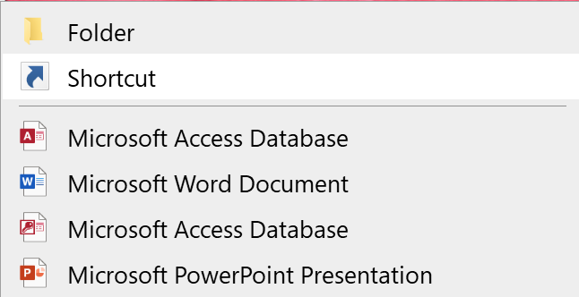  
    ---  
    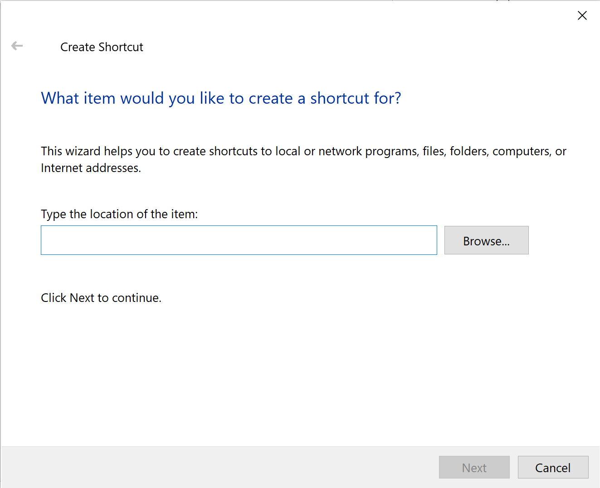  

4. Copy and Paste the following line as the location: 

    `C:\Windows\System32\cmd.exe /k "C:\Program Files (x86)\Microsoft Visual Studio\2019\Community\Common7\Tools\VsDevCmd.bat" -arch=amd64 -host_arch=amd64`  

    Note that you have to change **your own Visual Studio Install location** and **version** (Mine is 2019 Community)

5. You can rename the shortcut as “ROS”, and change the  
  `Property ->Advanced -> Run as administrator`  

    >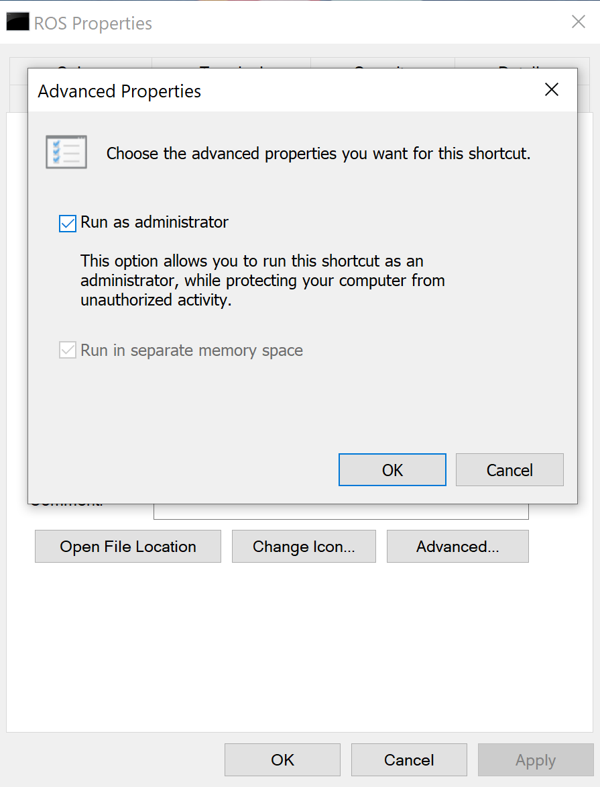  
6. Install Chocolatey  
-Open ROS Command (Created just now)  
-Copy and paste  

    `@"%SystemRoot%\System32\WindowsPowerShell\v1.0\powershell.exe" -NoProfile -InputFormat None -ExecutionPolicy Bypass -Command "iex ((New-Object System.Net.WebClient).DownloadString('https://chocolatey.org/install.ps1'))" && SET "PATH=%PATH%;%ALLUSERSPROFILE%\chocolatey\bin"`

    -Install Git  
    -Wait for previous command to finish 

    `Choco install git -y`  

## Installation 

1.	Open Ros command:  
    Copy and Paste the following  

    `choco source add -n=ros-win -s="https://roswin.azurewebsites.net/api/v2" --priority=1`  

2.  Wait for finish, then copy and paste following:  

    `choco upgrade ros-melodic-desktop_full -y`  

    We choose `melodic` version as it does not support previous ones  
    Then we wait for system to suto finish it may take up to **20mins**
      
3.	After finish :  
    Add this behind ROS command short cut destination:  

    `&& c:\opt\ros\melodic\x64\setup.bat`  
    
    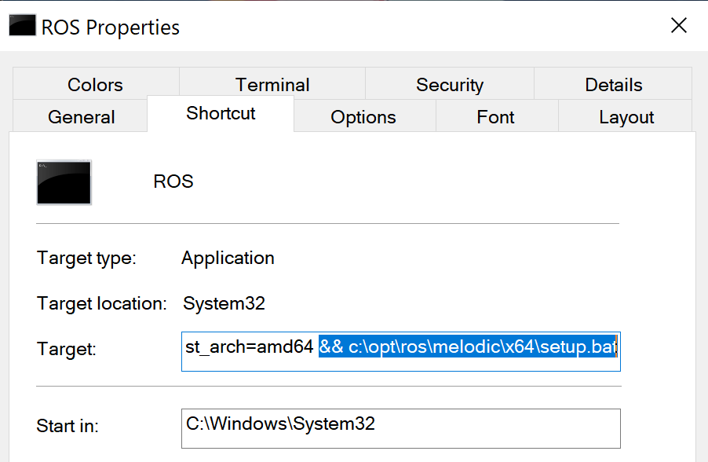  

    This is necessary as it helps to load cmake profiles.  
      
4. *(Optional)* Change `ROS_MASTER URI` (You master Device running `roscore`)  
    If you dont want to start a new `roscore` but to connect to your master such as a robot, you can do the following instruction:  
      -Create a `.txt` **including** following content: (Use your own Master address)  
        
    >`@echo off `  
    >`set ROS_MASTER_URI=@yourmaster:11311/`  

    save as `C:\bashrc.cmd` at disk `C`  

5. *(Optional)* Following step 4, open regedit: -> <kbd>Win</kbd>+<kbd>R</kbd> and enter `regedit`  
Find `[HKEY_LOCAL_MACHINE\Software\Microsoft\Command Processor]`
and add a **string key** named `Autorun`, value is `C:\bashrc.cmd`   

    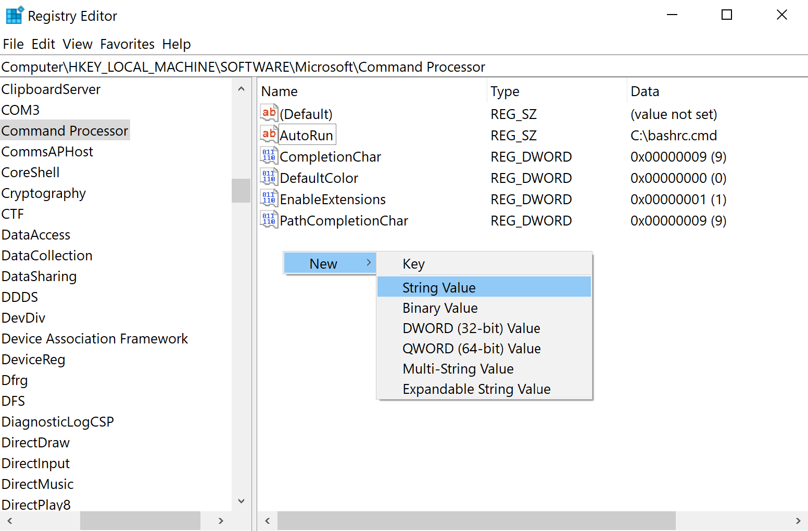 
    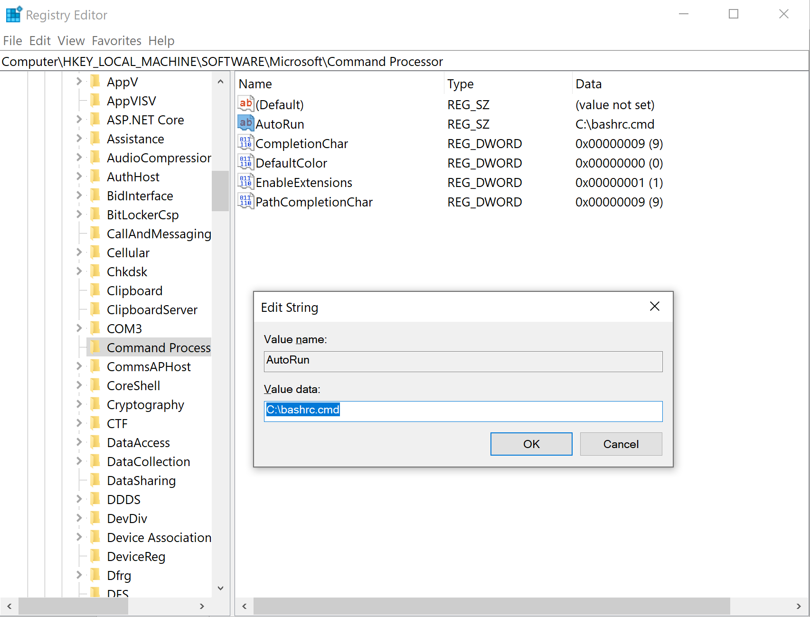 

## Configuration  
### Creating Catkin WorkSpace

1. Open ROS command (If you have your `roscore` runnign on you remote maste r you should see something like this)  

    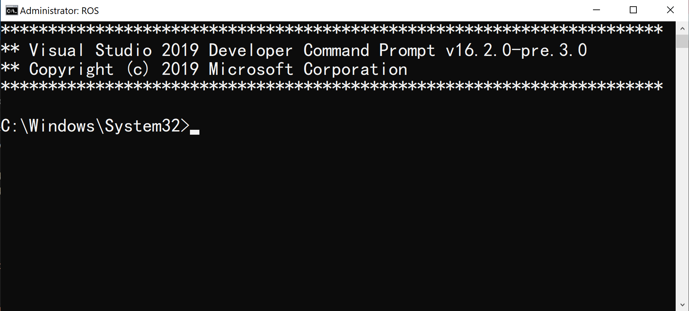  
2. `cd` to place you want to create your workspace, we use `C:\` here  

    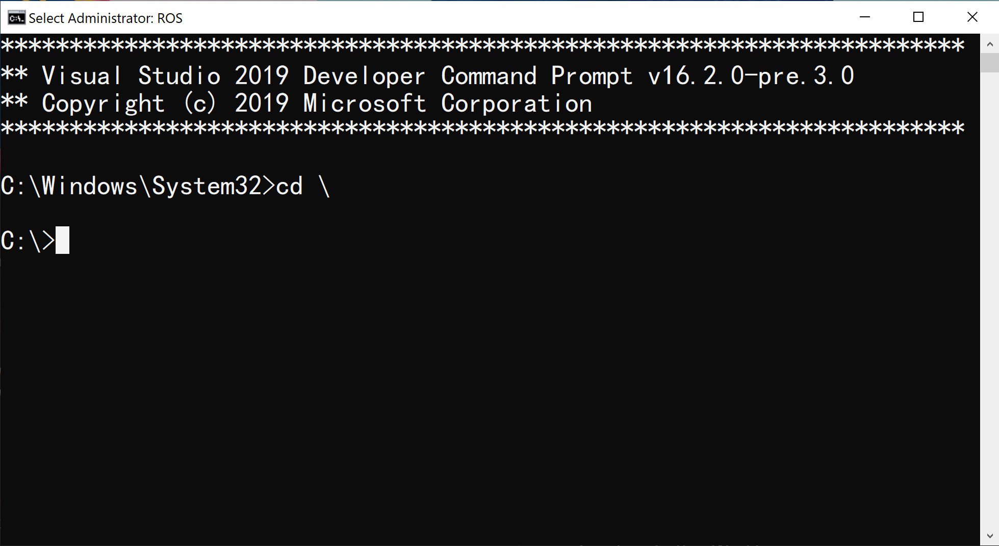  

3. Create ur own catkin workpalce `mkdir my_catkin_wp\src` with an `src` folder inside to place packages I suggest to use C root space, if you are using your own space, note that **all folders involved in the path should not contain special characters like space**  

    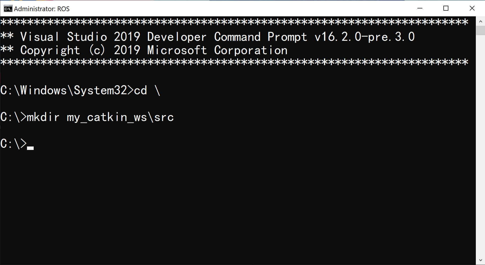  

4. `cd` to you workspace and initialilse catkin for configuration  

    `catkin_make`  
      
    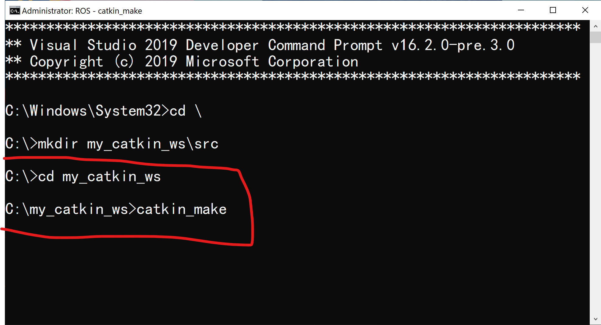  
    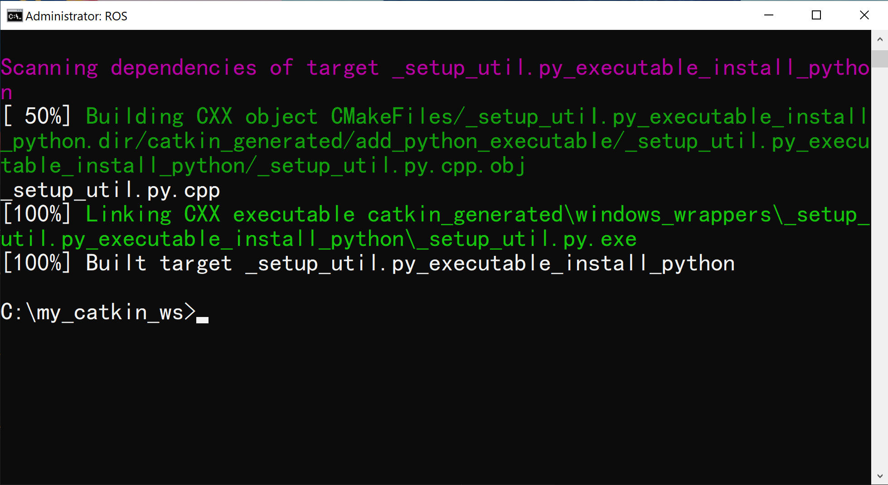  

    You should see these folders, for detail usage of these folders please refer to [ROS.wiki](http://wiki.ros.org/catkin):  

    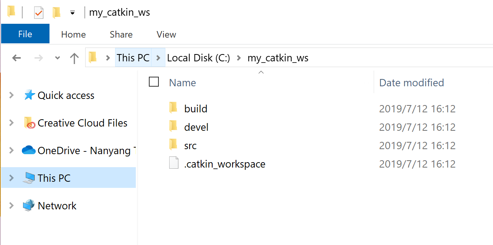  

5. `cd` to your `src` folder and create your own package, for those `rospack` dependency you should add it behind, here we use `roscpp rospy` and `std_msgs`, for usage of these packages please refer to [ROS.wiki](http://wiki.ros.org/catkin):

    `catkin_create_pkg helloworld roscpp rospy std_msgs`  

    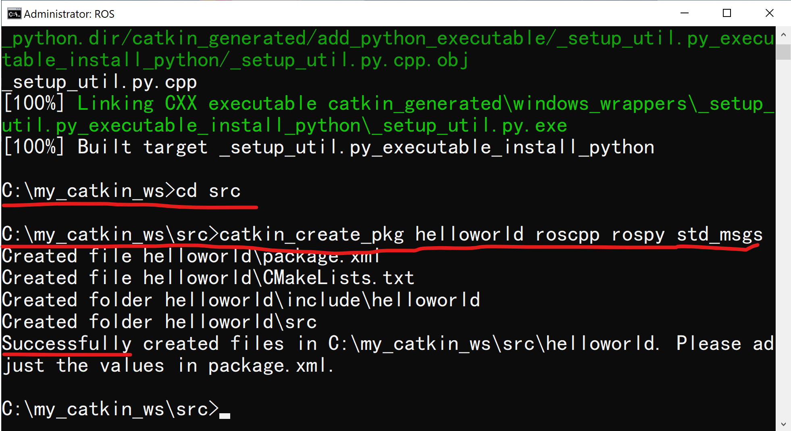  

    Now save your setings by calling `devel\setup.bat`  

    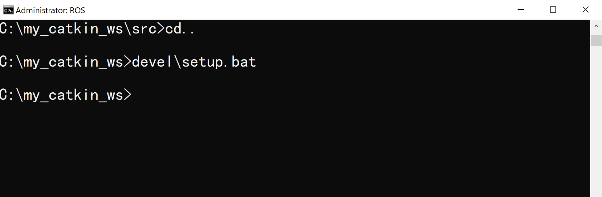
      
6. Now we have come to the end of comfiguration process, enter `devenv` to start your IDE . Then `Choose from your local folder to open up your catkin workspace`  

    

### Ros Development With Visual Studio ###

1. As Visual Studio is using different settings for CMake project. We need to configure the CMake file. If you have followed the tutorial correctly, should see this picture while you open the `devenv` Visual studio  

    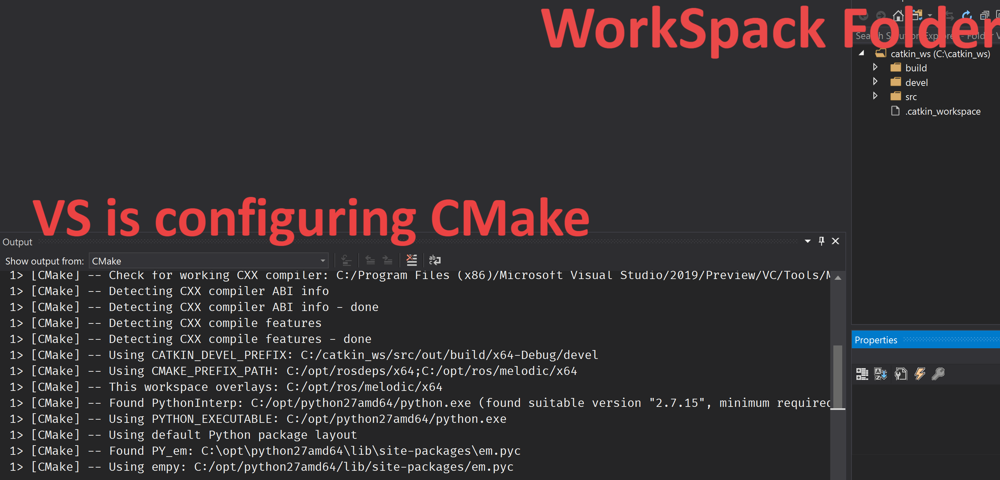  
    
2. Right click `src -> CMakeLists.txt` and go to Cmake settings  

    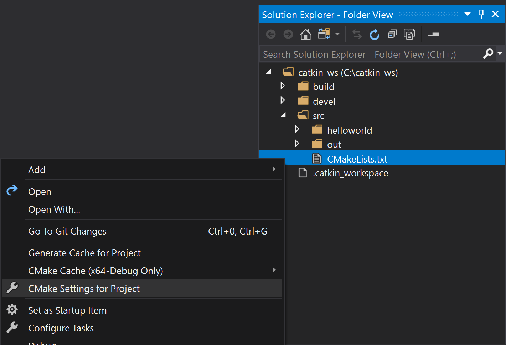  

    Click button <Kbd>Edit Json</Kbd>

    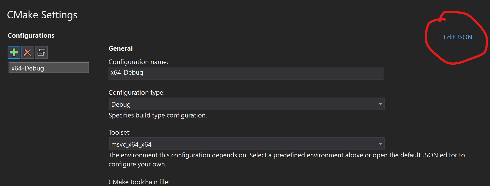  

3. In the json file, edit the following lines:  

    ->>`"generator": "NMake Makefiles"` ->> This because `Catkin_make` uses `NMake` instead of `Ninja`  
    ->>`"configurationType": "RelWithDebInfo"` ->> Match with Catkin Type  
    ->>`"buildRoot": "C:\\catkin_ws\\build"` ->> Change build root to **your own workspace folder** (refer to you solution penal on the right side)  
    ->>`"installRoot": "C:\\catkin_ws\\install"` ->> Change install root to **your own workspace folder** (refer to you solution penal on the right side)  
    ->>`"cmakeCommandArgs": "DCATKIN_DEVEL_PREFIX=C:\\catkin_ws\\devel"` ->> Change develpment root to **your own workspace folder** (refer to you solution penal on the right side)  
    ->>~~`"buildCommandArgs": "-v"`~~  
    ->>`"cmakeExecutable": "C:/opt/rosdeps/x64/bin/cmake.exe" ` ->> Add this line to use ROS default cmake to avoid confusing errors.  

    Refer to following pictures:  

    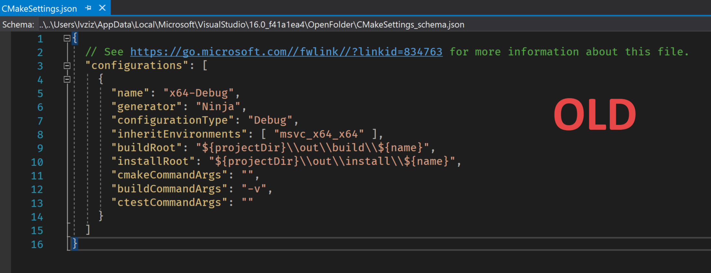  
    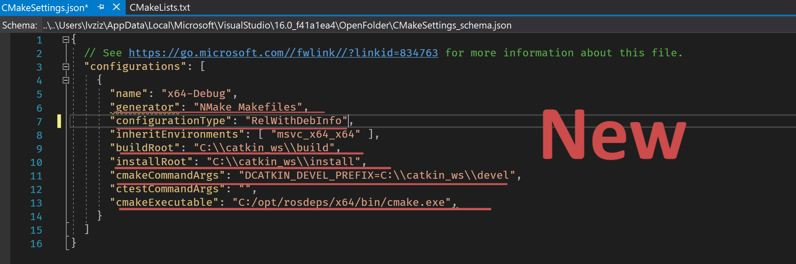  

4. Now in he file explorer, we can <Kbd>delete</Kbd> the `out` folder which is the default build forlder for visual studio  

    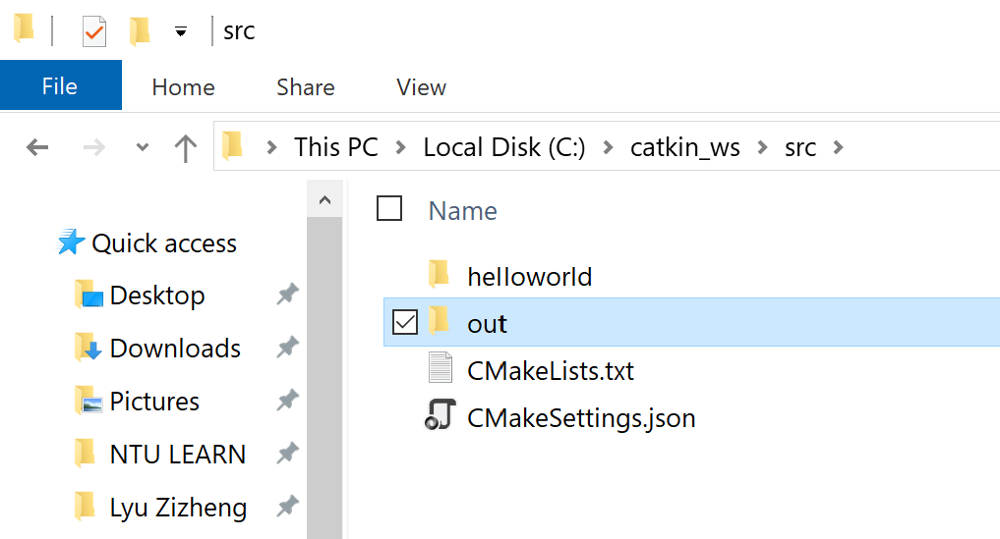  

## Test RosPackage ##

Add a new file in `src -> helloworld -> src` and name it `helloworld.cpp` (or other name you prefer)

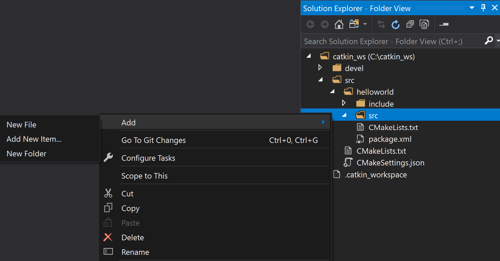  

You would see that the file is catagorised as `Miscellaneous file`, as we are yet to include it in our cmake project.  For a miscellaneous file, we are not getting intellisense.

Open `src -> helloworld -> src -> CmakeLists.txt` and find the line  

`# add_executable(${PROJECT_NAME}_node src/helloworld_node.cpp)`  

->> Uncomment the line (for those who use personalised cpp file name you need to change the path)  

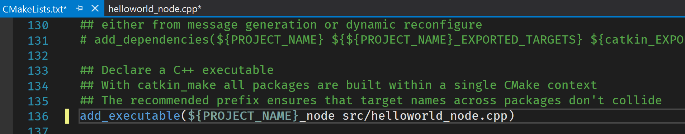  

Now we are getting intellisense for our cpp file  

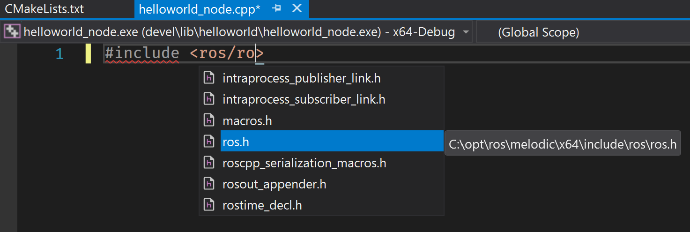  

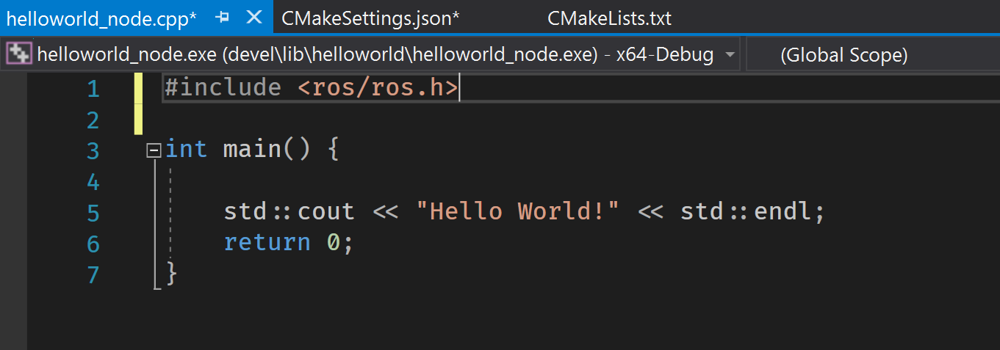  

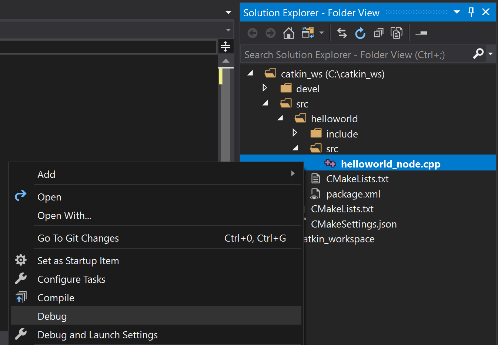  

Helloworld!

End of tutorial

Reference:  
https://ms-iot.github.io/ROSOnWindows/GettingStarted/Setup.html  
https://superuser.com/questions/144347/is-there-windows-equivalent-to-the-bashrc-file-in-linux

      

